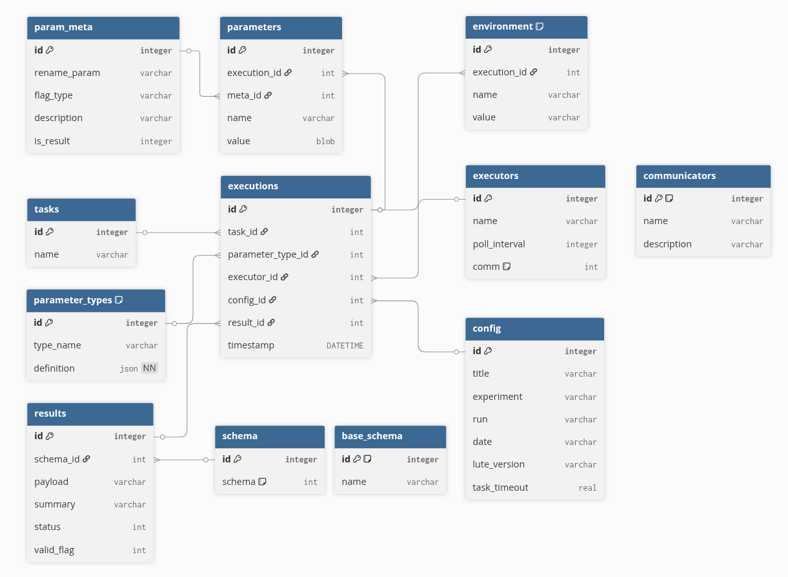

# LUTE Configuration Database Specification
**Date:** 2025-08-12
**VERSION:** v0.2

## Basic Outline
- The backend database will be sqlite, using the standard Python library.
- A high-level API is provided, so if needed, the backend database can be changed without affecting `Executor` level code.
- One LUTE database is created per working directory for this iteration of the database. Note that this database is independent of any database used by a workflow manager (e.g. Airflow) to manage task execution order.
- Attempts were made to make the database 3NF/BCNF normal; however, denormalization was chosen in some cases for simplicity.
- Each database has the following tables:
    - 1 table for `executions`: Each time any **Managed** Task is run a new entry is made in this table.
    - 1 table for `tasks`: Contains the listing of **Managed** Tasks, the `executions` table links here.
    - 1 table for `executors`: Contains the listing of `Executors`, the `executions` table links here.
    - 1 table for `config`: Contains sets of parameters used for the `AnalysisHeader`, the `executions` table links here.
    - 1 table for `results`: Contains the result fields for each execution. The `executions` table links here.
    - 1 table for `environment`: Contains environment variables and values, each one linked to a specific execution in the `executions` table.
    - 1 table for `communicators`: The entries in the `executors` table link as needed here.
    - 1 table for `schema`: The `results` table links to entries in this table to describe which schemas the results conform to.
    - 1 table for `base_schema`: The `schema` table entries are constructed as the bitwise or of the ids in this table, since a result may implement multiple `base_schema`.
    - 1 table for `parameters`: Contains the parameters and their values. Each entry links to a specific execution in the `executions` table.
    - 1 table for `parameter_types`: Which contain the type specifications to fully reconstruct a parameter. The entries in both the `executions` table, and the `parameters` table link here. The former is linked to describe the full `TaskParameters` model for the execution. The latter links to describe the type of each parameter in the `TaskParameters` model.
    - 1 table for `param_meta`: Which contains additional fields used internally to properly construct parameter fields.

### Schematic

### `executions` table

The `executions` table contains an entry for each time any **Managed** Task is run. It links all necessary information together.

| id | task_id | parameter_type_id | executor_id | config_id | result_id | timestamp             |
|:--:|:-------:|:-----------------:|:-----------:|:---------:|:---------:|:---------------------:|
| 1  | 1       | 1                 | 1           | 1         | 1         | "YYYY-MM-DD HH:MM:SS" |
|    |         |                   |             |           |           |                       |

Each of the `xyz_id` columns follow the `id`s in the respective tables to allow a complete reconstruction of the `Task`, `TaskParameters`, `Executor`, and results data.

#### Column descriptions

| **Column**          | **Description**                                                                                  |
|:-------------------:|:------------------------------------------------------------------------------------------------:|
| `id`                | ID of the execution in this table.                                                               |
| `task_id`           | Pointer to the entry in the `tasks` table holding the information about the `Task` run.          |
| `parameter_type_id` | Pointer to the entry in the `parameter_types` table that describes the `TaskParameters` model.   |
| `executor_id`       | Pointer to the entry in the `executors` table holding the information about the `Executor` used. |
| `config_id`         | Pointer to the entry in the `config` table holding the `AnalysisHeader` for this execution.      |
| `result_id`         | Pointer to the entry in the `results` table holding the results for this execution.              |
| `timestamp`         | Timestamp for the execution.                                                                     |
|                     |                                                                                                  |

#### Constraints

This table DOES NOT contain constraints. This breaks full normalization to some degree. Redundant entries are allowed.

### `tasks` table

The `tasks` table holds `Task` names.

| id | name     |
|:--:|:--------:|
| 1  | "MyTask" |
|    |          |

#### Constraints

- `name` must be unique.

#### Column descriptions

| **Column**          | **Description**                            |
|:-------------------:|:------------------------------------------:|
| `id`                | ID of the entry in this table.             |
| `name`              | Name of the `Task`.                        |
|                     |                                            |

### `executors` table

The `executors` table holds information about the kinds of `Executors` being used.

| id | name     | comm |
|:--:|:--------:|:----:|
| 1  | "MyTask" | 3    |
|    |          |      |

#### Column descriptions

| **Column** | **Description**                                                                                          |
|:----------:|:--------------------------------------------------------------------------------------------------------:|
| `id`       | ID of the entry in this table.                                                                           |
| `name`     | Name of the `Task`.                                                                                      |
| `comm`     | Bitwise OR of entries in the `communicators` table describing the communicators used by this `Executor`. |
|            |                                                                                                          |

#### Constraints

- The combination of all columns (name, poll_interval, comm) must be unique. Multiple executions can reference the same row of this table.
- The `comm` entry must be a BITWISE OR of the ids in the `communicators` table. This constraint is setup by the separate triggers rather than on table creation.

### `config` table

| id | title                | experiment | run | date       | lute_version | task_timeout |
|:--:|:--------------------:|:----------:|:---:|:----------:|:------------:|:------------:|
| 2  | "My experiment desc" | "EXPx00000 | 1   | YYYY/MM/DD | 0.1          | 6000         |
|    |                      |            |     |            |              |              |

These parameters are extracted from the `TaskParameters` object. Each of those contains an `AnalysisHeader` object stored in the `lute_config` variable. For a given experimental run, this value will likely be shared across any `Task`s that are executed.

#### Column descriptions

| **Column**     | **Description**                                                                                         |
|:--------------:|:-------------------------------------------------------------------------------------------------------:|
| `id`           | ID of the entry in this table.                                                                          |
| `title`        | Arbitrary description/title of the purpose of analysis. E.g. what kind of experiment is being conducted |
| `experiment`   | LCLS Experiment. Can be a placeholder if debugging, etc.                                                |
| `run`          | LCLS Acquisition run. Can be a placeholder if debugging, testing, etc.                                  |
| `date`         | Date the configuration file was first setup.                                                            |
| `lute_version` | Version of the codebase being used to execute `Task`s.                                                  |
| `task_timeout` | The maximum amount of time in seconds that a `Task` can run before being cancelled.                     |
|                |                                                                                                         |

#### Constraints

- The combination of all columns (title, experiment, run, date, lute_version, task_timeout) must be unique. Multiple executions can reference the same row of this table.

### `results` table

| id | schema_id | payload   | summary   | status    | valid_flag |
|:--:|:---------:|:---------:|:---------:|:---------:|:----------:|
| 2  | 3         | "Payload" | "Summary" | COMPLETED | 1          |
|    |           |           |           |           |            |

#### Column descriptions

| **Column**   | **Description**                                                                                                                        |
|:------------:|:--------------------------------------------------------------------------------------------------------------------------------------:|
| `id`         | ID of the entry in this table.                                                                                                         |
| `schema_id`  | Pointer to the entry in the `schema` table that describes the output produced by the `Task`                                            |
| `payload`    | Potentially full result. If the object is incompatible with the database, will instead be a path where it can be found.                |
| `summary`    | Short text summary of the `Task` result. This is provided by the `Task`, or sometimes the `Executor`.                                  |
| `status`     | Reported exit status of the `Task`. Note that the output may still be labeled invalid by the `valid_flag` (see below).                 |
| `valid_flag` | A boolean flag for whether the result is valid. May be `0` (False) if e.g., data is missing, or corrupt, or reported status is failed. |
|              |                                                                                                                                        |

#### Constraints

- The combination of all columns (schema_id, payload, summary, status, valid_flag) must be unique. Multiple executions can reference the same row of this table.

### `environment` table

| id | execution_id | name   | value       |
|:--:|:------------:|:------:|:-----------:|
| 2  | 3            | "PATH" | "/usr/bin/" |
|    |              |        |             |

#### Column descriptions

| **Column**     | **Description**                                                                |
|:--------------:|:------------------------------------------------------------------------------:|
| `id`           | ID of the entry in this table.                                                 |
| `execution_id` | Pointer to the entry in the `executions` table that this env var was used for. |
| `name`         | Environment variable name.                                                     |
| `value`        | Environment variable value.                                                    |
|                |                                                                                |

#### Constraints

This table DOES NOT contain constraints. This breaks full normalization to some degree. A unique index is constructed from (execution_id, name), however.

### `communicators` table

The `communicators` table holds descriptions of implemented `Communicator` objects. The entries may be associated to multiple `Executors`.

| id | name               | description                        |
|:--:|:------------------:|:----------------------------------:|
| 2  | SocketCommunicator | "Communication over TCP sockets.." |
|    |                    |                                    |

#### Column descriptions

| **Column**    | **Description**                                             |
|:-------------:|:-----------------------------------------------------------:|
| `id`          | ID of the entry in this table.                              |
| `name`        | Name of the `Communicator`.                                 |
| `description` | Description of communication method. E.g. used TCP sockets. |
|               |                                                             |

#### Constraints

- The (name, description) combination must be unique. The name is allowed to be duplicate, because the same Communicator may have slightly different implementations which are reflected in the description column.
- The `id` entry must be a power of 2 as the `schema` table uses a bitwise OR to indicate implementation of multiple `base_schema`.

### `schema` table

The `schema` table holds information about the combinations of schemas implemented by the various results. This is the information provided in `impl_schemas` when construction parameter modls..

| id | schema |
|:--:|:------:|
| 1  | 3      |
|    |        |

#### Column descriptions

| **Column** | **Description**                                                                  |
|:----------:|:--------------------------------------------------------------------------------:|
| `id`       | ID of the entry in this table.                                                   |
| `schema`   | This is a bitwise OR of all the ids in the `base_schema` table which contribute. |
|            |                                                                                  |

A particular value of `schema` may for example be:

- `0`: No schemas implemented
- `1`: `base_schema` 1 is implemented
- `2`: `base_schema` 1 is implemented
- `3`: `base_schema` 1 and 2 are implemented

All the ids in the `base_schema` table are powers of two, or the value 0.

The `schema` column of the `schema` table is constrained to be `schema <= SELECT SUM(id) FROM base_schema`.

#### Constraints
- The `schema` column must be unique. Multiple executions may reference the same entry in this table.
- The `schema` entry must be a BITWISE OR of the ids in the `base_schema` table. This constraint is setup by separate triggers rather than on table creation.

### `base_schema` table

The `base_schema` table holds the currently supported basic schema that may be provided. These are atomic, but a `Task` may implement multiple entries from this table.

| id | name   |
|:--:|:------:|
| 0  | "none" |
| 1  | "hdf5" |
| 2  |        |
| 4  |        |

#### Column descriptions

| **Column** | **Description**                                   |
|:----------:|:-------------------------------------------------:|
| `id`       | ID of the entry in this table.                    |
| `name`     | A string representation for this base schema type |
|            |                                                   |

The `id` column of this table is constrained to be the value 0 or a power of two: `CHECK (id = 0 OR (id > 0 AND (id & (id - 1)) = 0))`.

#### Constraints

- The name (and id) must be unique.
- The `id` entry must be a power of 2 as the `schema` table uses a bitwise OR to indicate implementation of multiple `base_schema`.

### `parameters` table

The `parameters` table holds combinations of parameters and their values.

| id | execution_id | meta_id | name      | value |
|:--:|:------------:|:-------:|:---------:|:-----:|
| 2  | 3            | 3       | "param_1" | 2     |
|    |              |         |           |       |

#### Column descriptions

| **Column**     | **Description**                                                                           |
|:--------------:|:-----------------------------------------------------------------------------------------:|
| `id`           | ID of the entry in this table.                                                            |
| `execution_id` | Pointer to the execution where this parameter/value combination was used.                 |
| `meta_id`      | Pointer to the entry in the `param_meta` table containing associated parameter meta data. |
| `name`         | Parameter name.                                                                           |
| `value`        | Parameter value.                                                                          |
|                |                                                                                           |

#### Constraints

This table DOES NOT contain constraints. This breaks full normalization to some degree. Redundant entries are allowed.

### `param_meta` table

The `param_meta` table holds meta data combinations that can be associated to a parameter/value combination. A single meta data set may be associated to multiple parameter/value entries. The meta data in this table is mostly used for internal LUTE objects, but also contains information about reconstructing the parameter type.

| id | rename_param | flag_type | description         | is_result |
|:--:|:------------:|:---------:|:-------------------:|:---------:|
| 2  | "new_param"  | "--"      | "new-param does X." | 0         |
|    |              |           |                     |           |

#### Column descriptions

| **Column**     | **Description**                                                                                        |
|:--------------:|:------------------------------------------------------------------------------------------------------:|
| `id`           | ID of the entry in this table.                                                                         |
| `flag_type`    | Specify the type of flag for passing this argument. One of `"-"`, `"--"`, or `""`                      |
| `rename_param` | Change the name of the parameter as passed on the command-line.                                        |
| `description`  | Documentation of the parameter's usage or purpose.                                                     |
| `is_result`    | `bool`. If the `set_result` `Config` option is `True`, we can set this to `True` to indicate a result. |
|                |                                                                                                        |

#### Constraints

- The combination of all columns (rename_param, flag_type, description, is_result) must be unique. Multiple parameters can reference the same row of this table.

### `parameter_types` table

The `parameter_types` table holds type reconstructions.

| id | type_name   | definition            |
|:--:|:-----------:|:---------------------:|
| 2  | MyTypeClass | "json_model_of_class" |
|    |             |                       |

#### Column descriptions

| **Column**   | **Description**                                           |
|:------------:|:---------------------------------------------------------:|
| `id`         | ID of the entry in this table.                            |
| `type_name`  | The name of the type - usually a Python class name.       |
| `definition` | A json string that can be used to reconstruct the object. |
|              |                                                           |

**Note**: Despite parameters themselves possibly having a complex type definitions, they do not reference entries in this table (either through the `parameters` or `param_meta` table). The overall `TaskParameters` object schema contains the definitions of all parameters, so the individual parameters do not need to also reference this table.

#### Constraints

- The `definition` column must be unique. The `type_name` column is allowed to be repeated to account for the possibility (although small) that a TaskParameters object is updated over the lifetime of the database.
- The `definition` is required to be NOT NULL. All entries in the table must contain a definition.

## API
This API is intended to be used at the `Executor` level, with some calls intended to provide default values for Pydantic models. Utilities for reading and inspecting the database outside of normal `Task` execution are addressed in the following subheader.

### Write
- `record_analysis_db(cfg: DescribedAnalysis) -> None`: Writes the configuration to the backend database.
- ...
- ...

### Read
- `read_latest_db_entry(db_dir: str, task_name: str, param: str) -> Any`: Retrieve the most recent entry from a database for a specific Task.
- ...
- ...

## Utilities
### Scripts
- `invalidate_entry`: Marks a database entry as invalid. Common reason to use this is if data has been deleted, or found to be corrupted.
- ...

### TUI and GUI
- `dbview`: TUI for database inspection. Read only.
- ...
