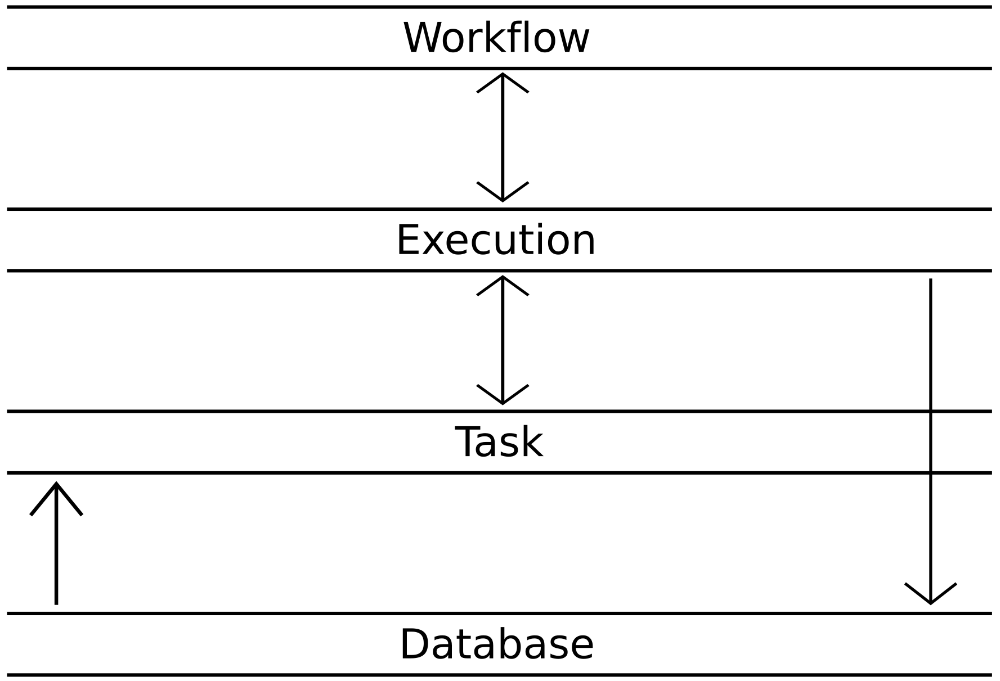
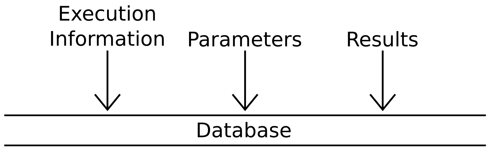
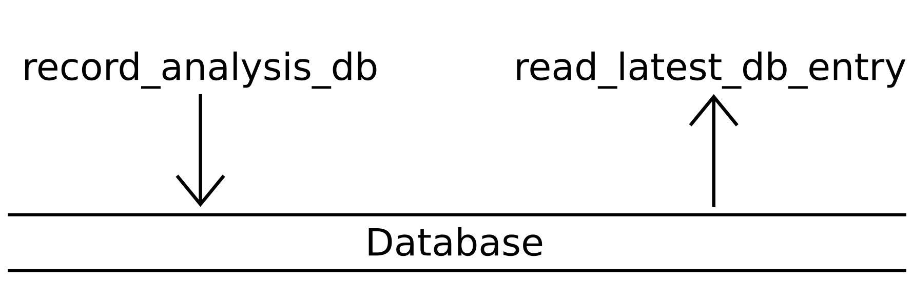
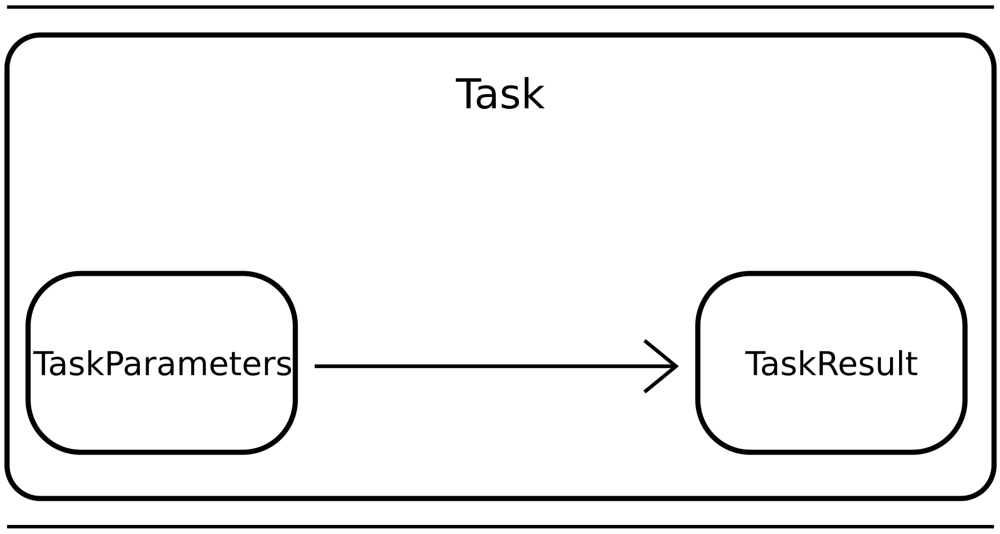
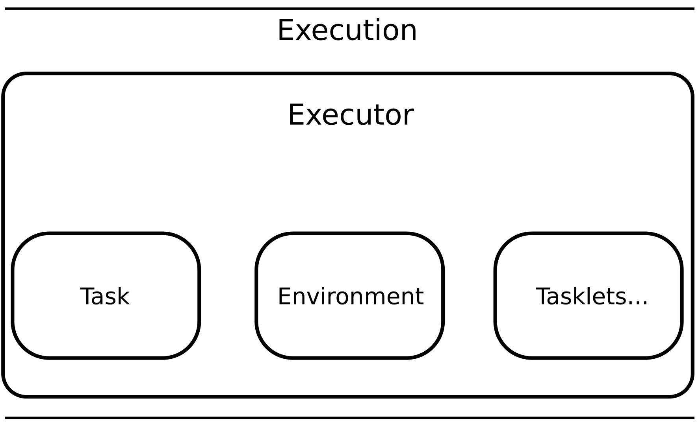
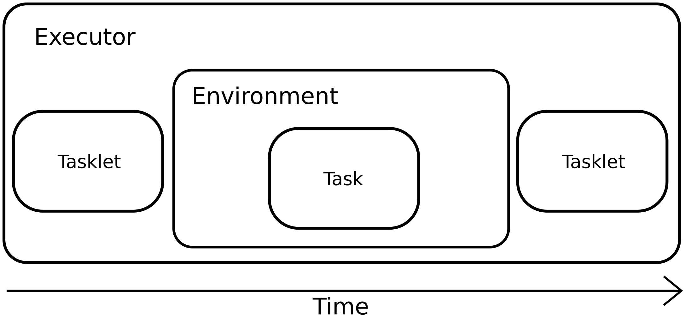
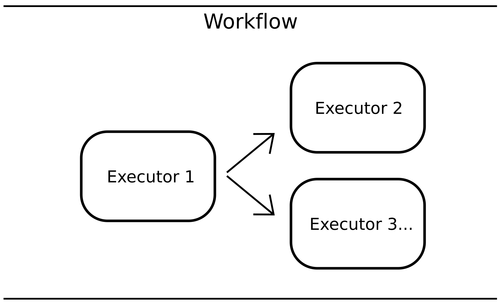
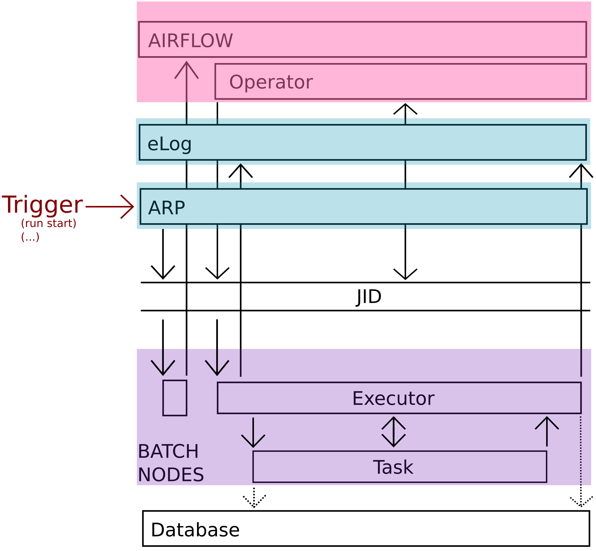

# LUTE Architecture and Execution Model

The following page attempts to provide an overview of the architecture of LUTE and the various steps and components involved in its execution model.

## Architecture

The LUTE architecture consists of four separate layers:
- A database layer for storing parameter information and the results of analysis.
- A `Task` layer which runs analysis code.
- An execution layer which manages the differing environments used by components of the `Task` layer.
- A workflow layer which launches series of **managed** `Task`s (see below), in a specified order, to run various analysis routines in their respective environments.

A rough schematic of the architecture and how the various layers communicate with each other is given by:



### Glossary

| Term               | Meaning                                                                                                                                                 |
|:------------------:|:--------------------------------------------------------------------------------------------------------------------------------------------------------|
| `Task`             | A unit of code “of interest” – e.g. may be an algorithm. Definition is flexible but typically will encompass processing until a natural stopping point. |
| `Executor`         | A manager – executes or runs a Task in a specific environment and provides interactions with UI, etc.                                                   |
| **Managed** `Task` | Executor + Task to run. When code is executed in LUTE, it is done through **managed** `Task`s. Task code on its own is not usually submitted.                 |
| `Tasklet`          | A Python function attached to a **managed** `Task`.                                                                                                     |
| `DAG`              | Directed acyclic graph. A workflow, i.e., a number of **managed** `Task`s and their dependencies.                                                                                                                                                        |

## Database Layer

The database layer stores a complete set of information required for reproducing a processing step upon completion of that step, regardless of whether the analysis exited successfully.

The information stored includes:

- Parameter sets
- Results information - This may be a pointer to objects stored on a filesystem (i.e. a path), or the result itself the result can be simply represented, such as by a scalar value.
- Execution information - Information about communication protocols used between `Task` and `Executor`, as well as pertinent environment variables.

**Importantly**, all the data stored in the database is available to subsequent processing steps. In this way `Task`s which are written to be runnable independently can be chained together into workflows which specify dependencies between them.



The database API is designed to be light-weight. The current implementation makes use of a sqlite database for portability, but this can be exchanged as needed.

In general, the API is designed with the idea the `Task` layer reads from the database, while the Execution layer writes.



## `Task` Layer

The `Task` layer consists of the actual analysis "code of interest". In paritcular, it is composed of three main objects:

- `TaskParameters`: A model comprising a set of type-validated parameters needed to run the `Task`.
- `TaskResult`: A description of the result of the analysis. Depending on the `Task`, the entire result may be contained within this object, although frequently a `Task` will, e.g., write out a file, the path to which is recorded as the result.
- `Task`: The main code to run. This object also contains the parameters and results.



A `Task` can be instantiated by passing in an instance of the `TaskParameters` object. The `Task` can then be run by invoking the `run()` method. A script is provided to do this: `subprocess_task.py`, although this script is not intended to be run directly, but rather submitted by an `Executor` (see below).

The `subprocess_task.py` script will go through the following steps:

1. `subprocess_task.py` does parameter validation. A configuration YAML is parsed for the specific `Task` we want to run, and the parameters are type-validated. If the validation fails, the script exits at this point without attempting to execute the analysis code.
2. `Task` is created and signals it is ready to start to the `Executor`. It passes along the validated parameter set along with this signal. After signalling, the process suspends itself with a `SIGSTOP`. This gives the `Executor` time to run any tasklets it may need to.
3. The process is resumed by the `Executor` when appropriate and the `Task` begins its actual analysis.
4. On completion the `Task` sends the result back to the `Executor` and exits.

## Execution Layer

The execution layer runs a `Task` in the appropriate environment. It consists of a number of principle objects:

- `Executor`: Orchestrates and manages `Task` running. The `Executor` also manages database writes and results presentation via preferred UI.
- `Task`: The code to execute
- Tasklets: Auxiliary functions. These are also run by the `Executor`, either before or after the main `Task`. They can take in as arguments the parameters which are passed to the main `Task`.



A **managed** `Task`, in LUTE terminology, is an instance of an `Executor` which in turns runs (i.e. manages) a `Task` (the actual analysis code to be run). In nearly all cases, except for perhaps when debugging, **managed** `Task`s are the smallest executable units in LUTE. I.e. all analysis is submitted via **managed** `Task`s, rather than by running the `Task` itself. A simple script, `run_task.py`, is provided to run one:

```bash
> python -B [-O] run_task.py -t <ManagedTaskName> -c </path/to/config/yaml>
```

This script takes the name of the **managed** `Task` and the path to the configuration YAML file. The **managed** `Task` is selected from one of those defined in the module `managed_tasks.py`, and then its `execute_task()` method is run.

On calling `execute_task()`, the `Executor` goes through the following stages:

1. The `Executor` updates the environment that the `Task` will run in. How it does so is defined by using the `update_environment()` and `shell_source()` methods when it is created in the `managed_tasks.py` file. If these methods are not callled, then the `Task` will execute in the environment of the `Executor`.
2. The `Executor` then submits the `subprocess_task.py` as a subprocess. The script will run the specified `Task` and enter its task loop. The subprocess is launched with any environment modifications created in step 1.
3. The `Task` process will auto-suspend (see above). At this point the `Executor` will run any `tasklets` that need to be run before the main analysis. **NOTE:** Because the subprocess has already been launched at this point, the `tasklet` can **NOT** perform any environment modifications. On the other hand, however, the `Executor` will now have access to validated parameters for the `Task`, so these can be used as arguments to the `tasklet`. See here for more information on `tasklet`s.
4. After running all `tasklet`s, the `Executor` will then resume the `Task` process. It then continues processing signals, messages, etc., until the process completes, either successfully or due to an error.
5. When the subprocess exits, post-`Task` `tasklets` are run and any results are processed by the `Executor`. This may include activities such as preparing figures for the eLog.
6. Finally, the `Executor` records the information about the `Task` execution into the database.



## Workflow Layer

The workflow layer controls the order of submission of a number of **managed** `Task`s. In the most generic form, it consists of:

- A series of **managed** `Task`s (`Executor`s)
- A description of the connectivity or dependencies between them. This may also include additional information such as early termination or special submission conditions, e.g. end a workflow early if `Executor` 2 reports success. Or, run `Executor` 3 only if `Executor` 1 reports failure.



Currently, the workflow layer is provided by either Airflow, or Prefect. The code running in the workflow layer is mostly independent of the rest of the code base. The workflow orchestration, in fact, runs simultaneously but on separate machines than the **managed** `Task`s it is submitting.

A schematic overview of the various components in an Airflow-based workflow running on S3DF is given below. A trigger, such as the start of a DAQ run, reaches the `ARP` (automatic run processor), which causes a small batch job to be started on S3DF. This batch job makes a request to the Airflow server to begin running a specific workflow. Airflow then submits `Operators`, which request **managed** `Task`s be submitted as batch jobs on the S3DF. Once the batch job has started, the execution proceeds through the various layers described above.


